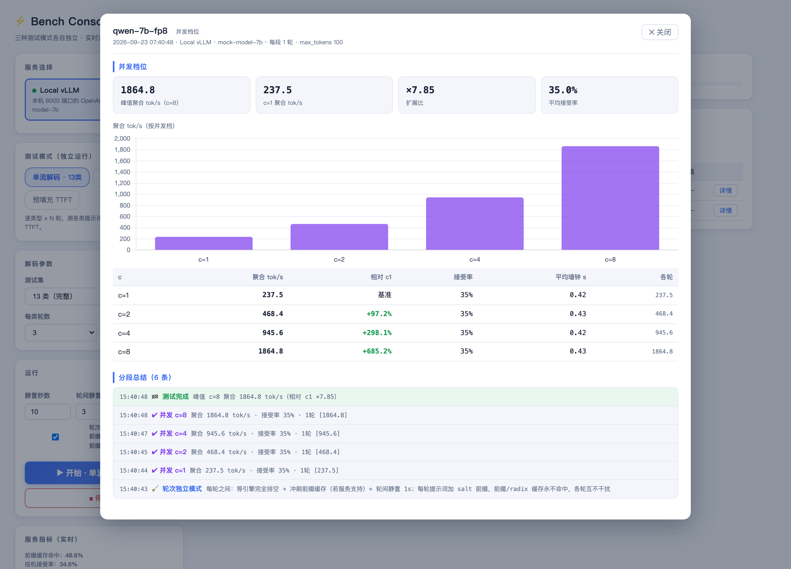
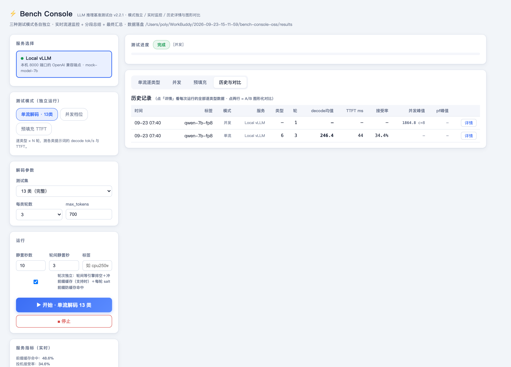

# ⚡ Bench Console

**单文件、零依赖的 Web 基准测试台，测任何 OpenAI 兼容的 LLM 推理服务。**

指哪测哪：vLLM、SGLang、llama.cpp（`llama-server`）、Ollama、TGI —— 只要是一个 HTTP 端口上的 OpenAI API 就行。解码吞吐、TTFT、并发扩展比、前缀缓存命中率、投机解码接受率，全部在一个实时仪表盘里看。不需要 `npm install`，没有构建步骤。

[English](README.md)



## 为什么做这个

大多数压测脚本只给你一个 CSV。Bench Console 给你的是**测试过程中引擎到底在干什么** —— running/waiting 请求数、decode 与 prefill 各自的 tok/s、KV 缓存占用，边跑边看；每测完一段立刻弹出一条总结；跑完给出逐类型图表拆解。每次运行落盘成 JSON，之后随时把两次运行 A/B 对比。

## 功能

| | |
|---|---|
| 🧪 **三种测试模式各自独立** | 单流解码（13 类提示词）· 并发档位 · 预填充 TTFT |
| 📈 **实时监控** | 每 1s 采 `/metrics`：decode/prefill tok/s、running/waiting、KV 占用，实时折线 |
| 🧹 **轮次独立** | 每轮之间：等引擎排空 → 冲前缀缓存（支持时）→ 静置 N 秒 → 提示词加盐，前缀/radix 缓存永不命中 |
| 📊 **分段总结** | 每类型 / 每并发档 / 每长度档跑完立刻出一条事件流总结 |
| 🏁 **最终汇总** | 均值 / 中位 / 最快最慢 / 极差，排序条形图 + TTFT 图 |
| 🔍 **运行详情弹窗** | 逐类型完整表格（含每一轮）、逐档位曲线、任意两次运行 A/B 对比 |
| 🔐 **按服务配 apiKey** | 只在服务端使用，绝不下发到浏览器 |
| 🌐 **远程引擎** | 每个服务可配 `baseUrl`，测别的机器或 Docker 容器里的引擎 |
| 📦 **真·零依赖** | 一个 `.js` + 内置 Chart.js。只要 Node ≥ 18，别的什么都不要 |

## 快速开始

```bash
git clone https://github.com/polyuij42-del/bench-console.git
cd bench-console
cp config.example.json config.json   # 然后改 services
./scripts/start.sh                   # macOS / Linux
# scripts\start.bat                  # Windows
```

浏览器打开 **http://localhost:18777**，左边选服务，选模式，点开始。

环境要求：**Node.js ≥ 18**（用内置 `fetch`）。没有任何 npm 依赖 —— `npm install` 等于空跑。

### 不想写配置？

也能跑。没有 `config.json` 时监听 `0.0.0.0:18777`，默认探一个 `http://127.0.0.1:8000` 的服务。

## 三种测试模式

| 模式 | 做什么 | 指标 |
|---|---|---|
| **单流解码 · 13类** | 逐条发 13 类提示词（代码生成、修 bug、数学推理、JSON 抽取、翻译、摘要、创意写作、SQL、Agent 规划…），每类 N 轮 | decode tok/s、TTFT、投机解码接受率 |
| **并发档位** | 同一套提示词按并发 1/2/4/8/12/16/20/32 打 | 聚合 tok/s、相对 c=1 的扩展比 |
| **预填充 TTFT** | 发长提示词（1K–64K token）、`max_tokens=1`，走 `/v1/completions` | prefill TTFT → 各长度档 prefill tok/s |

提示词库在 [`prompts/`](prompts/) 目录，就是 `{id, name, prompt}` 的 JSON 数组，随便改。`config.prompts` 指到自己的文件就能测你的真实业务负载。

## 配置

`config.json`（已被 gitignore，从 `config.example.json` 复制）：

```jsonc
{
  "port": 18777,             // 仪表盘端口
  "host": "0.0.0.0",         // 监听地址
  "resultsDir": "results",   // 运行结果 JSON 落盘目录

  // 提示词库；键就是 UI 上的「测试集」代号
  "prompts": { "13": "prompts/prompts13.json", "6": "prompts/prompts6.json" },

  "services": [
    {
      "id": "8000",                     // 必填且唯一（内部身份标识）
      "port": 8000,                     // 展示用；也是默认 baseUrl 的端口
      "name": "Local vLLM",
      "desc": "单卡，fp8 kv"
    },
    {
      "id": "sgl-remote",
      "port": 8001,                     // 填了 baseUrl 时仅作展示
      "name": "SGLang 在另一台机器",
      "baseUrl": "http://192.168.1.50:8001",  // 默认 http://127.0.0.1:<port>
      "apiKey": "sk-..."                      // 可选，只在服务端用
    }
  ]
}
```

### 环境变量

| 变量 | 含义 | 默认 |
|---|---|---|
| `BENCH_PORT` | 仪表盘端口（优先级高于 config） | `18777` |
| `BENCH_HOST` | 监听地址 | `0.0.0.0` |
| `BENCH_CONFIG` | 指向别的配置文件 | `./config.json` |
| `BENCH_SERVICES` | 直接用 JSON 数组字符串传服务列表（优先级最高） | — |

## API

| 端点 | 说明 |
|---|---|
| `GET /api/config` | 当前生效的配置（路径、服务数） |
| `GET /api/services` | 服务列表 + `healthy` + 解析出的 `model`（不含 apiKey） |
| `POST /api/run` | 发起测试。Body：`{mode, sid\|port, model, suite, reps, concLevels, maxTokens, settle, repSettle, prefill:{enabled,lengths}, tag}` |
| `GET /api/run` | 当前/最近一次运行状态，含实时采样、事件流、最终汇总 |
| `POST /api/stop` | 立即中止；已完成的段仍会记账 |
| `GET /api/history` | 全部历史运行 |
| `GET /api/result?file=` | 单次运行详情 |
| `GET /api/metrics?sid=` | 前缀缓存命中率 + 投机接受率 |

示例：

```bash
curl -X POST http://localhost:18777/api/run -H 'Content-Type: application/json' -d '{
  "mode":"single", "sid":"8000", "model":"Qwen/Qwen3-8B",
  "suite":"13", "reps":3, "maxTokens":700, "settle":10, "tag":"baseline"
}'
```

结果写到 `results/<UTC时间戳>_<标签>_<模式>.json`。

## 轮次独立（你的 TTFT 之前为什么虚低）

同一个提示词连跑 N 轮，第 2 轮起必然命中引擎的前缀/radix 缓存 —— TTFT 变低不是因为引擎快了，是因为缓存热了。Bench Console 默认开启「轮次独立」（UI 里可关），每轮之间做三件事：

1. **排空** —— 轮询 `/metrics` 直到 `num_requests_running == 0 && num_requests_waiting == 0`（兼容 vLLM 新旧指标名与 SGLang），最多 20s。
2. **冲刷** —— 探测 `POST /reset_prefix_cache`（vLLM）/ `POST /flush_cache`（SGLang），支持则每轮冲一次。
3. **加盐** —— 每条提示词首部加独立 nonce，从 token 0 就不匹配，前缀缓存永不命中。

实测效果：`prefixHit` 恒为 `0`，各轮 TTFT 逐毫秒可复现。



## 部署成常驻服务

见 [`scripts/bench-console.service`](scripts/bench-console.service) —— systemd **user** 服务模板，含安装步骤（包括 `loginctl enable-linger` 让它注销后仍常驻）。

## 已知注意点

- **思考型模型**：token 计数兼容 `delta.content` / `delta.reasoning` / `delta.reasoning_content`，但后两个字段在部分引擎上拿不到 —— 如果 TTFT 整齐地显示 `0ms`，说明那个字段压根没收到（tok/s 仍有效，因为有 `usage.completion_tokens` 兜底）。
- **run-to-run 噪声是真实存在的。** 同一套配置隔 8 分钟跑两次，全类均值能差 ~20%。别拿单次跑下结论。
- 文件名里的时间戳是 **UTC**。
- `meanTps`/`meanTtft` 等于 `0` 的含义是「没测到」，不是「快到没时间」。

## License

[MIT](LICENSE)
